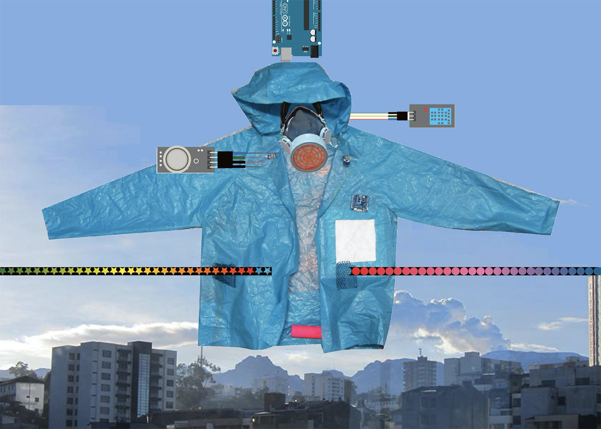
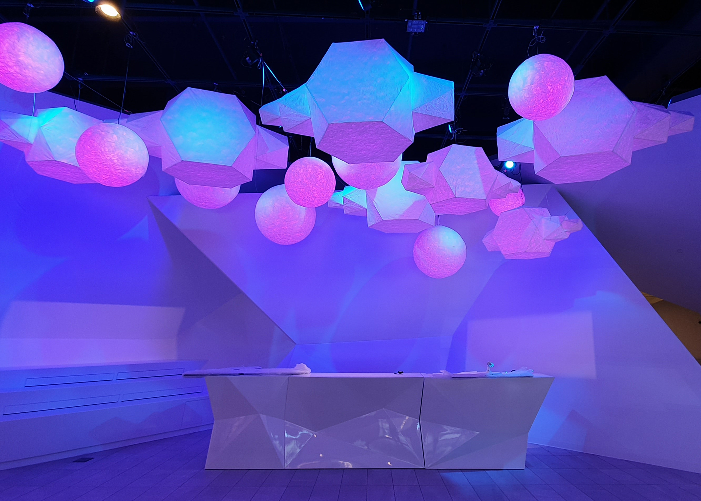
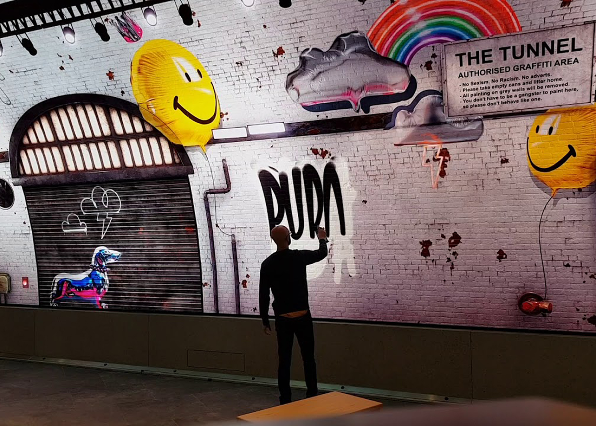

 
 
 

# PROCESSING COMMUNITY DAY BOGOTÁ

#### El [Processing Community Day](https://processingfoundation.org/advocacy/processing-community-day-2020) es una iniciativa mundial impulsada por el Processing Fundation para celebrar el arte, el código y la diversidad. Actualmente este evento involucra a más de 30 ciudades del mundo, tales como New York, Sao Paulo, Toronto, Londres, Madrid, entre otras.
#### Este día tiene como objetivo promover el uso de herramientas digitales e incentivar el interés de la comunidad en la creación visual a través de la programación. Se promueve un dialogo en donde se exponen diversas formas de trabajar y pensar con software, así como se comparten ideas en desarrollo y proyectos terminados, impulsando a aquellas personas interesadas en el área a aprender y a crear a partir de código.

 
 
 

## PROGRAMA

### Presentaciones

9:15 AM • Bienvenida

9:30 AM • [Maria Paulina Gutierrez](#maria-paulina-gutierrez)

10:30 AM • [Francesca Rodriguez](#francesca-rodriguez)

11:30 AM • [Cristian González](#cristian-gonz%C3%A1lez)

### Talleres

1:00 - 3:00 PM • [Introducción al Neoperreo Algorítmico](#introducci%C3%B3n-al-neoperreo-algor%C3%ADtmico)

3:00 - 5:00 PM • [Rituales Digitales](#rituales-digitales)

5:00 - 7:00 PM • [Manipulacion de ventanas con Processing](#manipulacion-de-ventanas-con-processing)

 
 
 

## PRESENTADORES

 
 

### [Maria Paulina Gutierrez](https://about.me/mariapaulina)

Máster en Diseño y Creación Interactiva en el campo de los textiles interactivos, diseño urbano y el medio ambiente. Profundamente talentosa y recursiva en la práctica de la moda con 10 años de experiencia en experimentación con diseño, fabricación y restauración de prendas de vestir, centrada en los métodos sostenibles de creación de patrones de ropa y técnicas innovadoras de la moda thinker maker bien establecidas en el marco de la ciencia, la tecnología y el diseño ecológico global y local.

|
----------|----------
|

 
 

### [Francesca Rodriguez](http://www.franrodriguezsawaya.com/)

Nacida en Lima, Perú y actualmente basada en Brooklyn, NY. Mis trabajos combinan mis habilidades y experiencia como productora creativa y tecnóloga. Me gradué del Programa de Telecomunicaciones Interactivas en NYU. Antes de eso, trabajé 7 años como productora de videos y contenido, donde guié proyectos desde la ideación hasta la ejecución.

También he estado explorando los vínculos entre el tejido y el pensamiento computacional, creando piezas que traducen historias orales en tejidos físicos que se han exhibido en el Festival New Latin Wave en Nueva York y el Festival Internacional de Arte Contemporáneo en Perú. Me desempeñé como investigadora en el Laboratorio de Tecnología en BF + DA en la Universidad de Pratt y también he dictado diferentes talleres sobre la intersección del tejido y la codificación, en lugares como Pioneer Works, Currents New Media Festival y el Museo de Brooklyn. Co-comisioné y produje la exposición “Beyond Punch Cards”, que reunió a artistas que desafían las percepciones comunes del tejido y la codificación, que tuvo lugar en Santa Fe, Nuevo México, en junio del año pasado.

|
----------|----------
|

 
 

### [Cristian González](https://tangibleinteraction.com/)

Como Ingeniero electrónico y desarrollador encuentro en la combinación entre arte, ciencia  y tecnología un escenario con el potencial  ideal para explorar la interacción humano-máquina mediante la creación de experiencias significativas diseñadas desde un enfoque centrado en el humano.

Actualmente basado en Vancouver, trabajo como arquitecto de soluciones para Tangible un estudio de arte y diseño, dedicado a la creación de experiencias y productos que reúnen y  conectan a las personas invitandolas a vivir el momento conectadas con sus sentidos y el entorno.

Con 8 años de experiencia en la industria creativa mi trabajo se enfoca al diseño, desarrollo e implementación de sistemas/instalaciones multimedia e interactivas que se caracterizan por integrar elementos como la creación de gráficos y contenido generativo en tiempo real, videojuegos, realidad mixta, mapping, live act, iluminación, computación física y diseño electrónico a la medida.

|
----------|----------
|

 
 
 

## Talleres

 
 

### Introducción al Neoperreo Algorítmico

 *¡Vamo’ al garete con las variables!*

Del Algorave al Reggaetron, con todo el flow del live coding. Una práctica traída desde las oscuras fiestas de hackers, y que juntos vamo’ a llevar a parisear. Daremos un paseo por diferentes entornos del código sonoro en vivo y luego a oir cómo la compu maquinea y como el código se arrebata bata en Sonic Pi. Perreo programado, beats y algorritmos. Conectando todo el dembow con Processing será un workshop para sandunguear. 

#### [Ícaro López](https://www.icskompany.com/)

Icaro López de Mesa es diseñador interactivo, artista electrónico y músico, apasionado por la creación y experimentación sonora. Su trabajo se ha desarrollado tanto en el campo artístico como en el comercial y es el resultado de exploraciones que combinan arte, sonido, nuevos medios, música y educación. Actualmente realiza una maestría en medios digitales en la universidad de las artes en Bremen, Alemania, donde desarrolla máquinas sonoras. 

 
 

### Rituales Digitales

En este taller exploraremos prácticas especulativas ligadas a rituales, magia, mitología y supersticiones desde un punto de vista cultural, filosófico y/o religiosos. 

Por medio de manifestaciones digitales contemporáneas, generaremos un espacio artificial y surrealista que se materialice a través de algoritmos. Si bien este no es un taller técnico, veremos como crear ejemplos básicos que nos permitan dar unos primeros acercamientos a escenarios ficticios, simbólicos y creativos.

>    “Any sufficiently advanced technology is indistinguishable from magic.”
>    - Clarke's third law.

|
----------|----------
   |   

*No hay necesidad de tener conocimiento previo en programación, ayudará eso sí, pero si el código glitchea culparemos al más allá, para todo lo demás podemos prenderle una vela a Ada Lovelace.*

*Opcional: [Lectura antes del taller.](https://www.vice.com/en/article/wnxpxm/why-we-still-practice-superstitious-rituals-with-our-technology)*

#### [Nathier Fernández](https://www.nathier.com/)

Nathier Fernández es una diseñadora y artista bogotana cuya practica multidisciplinaria se enfoca en la creacion de espacios, objetos y experiencias; en donde la tecnologia actua como una entidad mediadora y de transcipcion sobre las posibles interacciones humanas y no-humanas. Su investigacion tiene un especial interes en la interseción de los sistemas biologicos y artificiales. 

 
 

### Manipulacion de ventanas con Processing

La ventana es una de las metáforas más utilizadas en la informática. Estos contenedores rectangulares, permiten la entrada y salida de datos a nuestras máquinas y, a pesar de pasar desapercibidas la mayor parte del tiempo, son posiblemente la interfaz gráfica más utilizada a diario. La mayoría de las ventanas pueden ser redimensionadas, movidas, ocultadas, restauradas, y cerradas a voluntad. En este taller abordaremos las ventanas como elementos de interacción. Utilizando Processing aprenderemos a manipular los atributos subyacentes de las ventanas de nuestros sistemas operativos para usos creativos.

|
----------|----------
|

#### Laura Junco
Laura Junco es diseñadora de medios interactivos. Su trabajo se basa en la creación de dispositivos y experiencias digitales que exploran las relaciones cotidianas entre personas y dispositivos tecnológicos. Ha trabajado en el Centro Nacional de Memoria Histórica creando productos digitales que contribuyen a la protección y exigibilidad de derechos humanos en Colombia y, actualmente es diseñadora y desarrolladora de visualizaciones de datos en La Comisión de la Verdad de Colombia.

 
 

## Sobre el Processing Foundation

[Processing](https://processing.org/) es un lenguaje de programación y entorno de desarrollo de código abierto que busca la enseñanza y producción de proyectos interativos en el contexto de las artes visuales, creado por Casey Reas y Ben Fry a comienzos del siglo 21. Este lenguaje se basa en Java pero utiliza sintaxis simplificadas y gráficas, trabajando como una herramienta clave para artistas, diseñadores y otras disciplinas ajenas a la programación que buscan aprender las bases de programación con muestras visuales de la información.

[El Processing Foundation](https://processingfoundation.org) fue fundado en el 2012 con el objetivo de promover la alfabetización de software dentro de las artes visuales y los campos relacionados con tecnologías. El centro de su filosofía y política es un concepto conocido como FLOSS (Free, Libre, Open Source Software) ya que ven el Software como un medio que conecta el pensamiento con el hacer, y por esta razón deberia ser de gratis acceso. Ademas, afirman que aprender a programar no se trata unicamente de adquirir ciertas habilidades sino de tener un proceso creativo y exploratorio, por lo que debe ser accesible a todos.

 
 

**Organiza**

